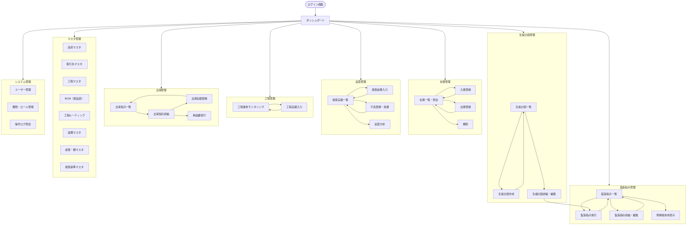

# 01. 画面遷移図

## 全体画面遷移

---

## 画面一覧

### 共通

| 画面ID | 画面名 | 概要 |
|--------|--------|------|
| SCR-COM-001 | ログイン | 認証 |
| SCR-COM-002 | ダッシュボード | KPIモニタリング・各機能へのナビゲーション |

### 製造指示管理

| 画面ID | 画面名 | 主な利用者 | 端末 |
|--------|--------|-----------|------|
| SCR-MO-001 | 製造指示一覧 | 生産管理担当 | PC |
| SCR-MO-002 | 製造指示発行 | 生産管理担当 | PC |
| SCR-MO-003 | 製造指示詳細・編集 | 生産管理担当 | PC |
| SCR-MO-004 | 現場端末用製造指示 | 現場リーダー・作業員 | タブレット |

### 生産計画管理

| 画面ID | 画面名 | 主な利用者 | 端末 |
|--------|--------|-----------|------|
| SCR-PP-001 | 生産計画一覧 | 生産管理担当 | PC |
| SCR-PP-002 | 生産計画作成・編集 | 生産管理担当 | PC |

### 在庫管理

| 画面ID | 画面名 | 主な利用者 | 端末 |
|--------|--------|-----------|------|
| SCR-INV-001 | 在庫一覧・照会 | 倉庫担当・生産管理担当 | PC・ハンディ |
| SCR-INV-002 | 入庫登録 | 倉庫担当 | ハンディ・PC |
| SCR-INV-003 | 出庫登録 | 倉庫担当 | ハンディ・PC |
| SCR-INV-004 | 棚卸 | 倉庫担当 | ハンディ |

### 品質管理

| 画面ID | 画面名 | 主な利用者 | 端末 |
|--------|--------|-----------|------|
| SCR-QC-001 | 検査実績一覧 | 品質管理担当 | PC |
| SCR-QC-002 | 検査結果入力 | 品質管理担当 | PC・タブレット |
| SCR-QC-003 | 不良登録・処置 | 品質管理担当 | PC・タブレット |
| SCR-QC-004 | 品質分析 | 品質管理担当・管理職 | PC |

### 工程管理

| 画面ID | 画面名 | 主な利用者 | 端末 |
|--------|--------|-----------|------|
| SCR-PROC-001 | 工程進捗モニタリング | 生産管理担当・管理職 | PC |
| SCR-PROC-002 | 工程実績入力 | 現場リーダー・作業員 | タブレット |

### 出荷管理

| 画面ID | 画面名 | 主な利用者 | 端末 |
|--------|--------|-----------|------|
| SCR-SH-001 | 出荷指示一覧 | 出荷担当 | PC |
| SCR-SH-002 | 出荷指示詳細 | 出荷担当 | PC・ハンディ |
| SCR-SH-003 | 出荷実績登録 | 出荷担当 | PC・ハンディ |
| SCR-SH-004 | 納品書発行 | 出荷担当 | PC |

### マスタ管理

| 画面ID | 画面名 |
|--------|--------|
| SCR-MST-001 | 品目マスタ |
| SCR-MST-002 | 取引先マスタ |
| SCR-MST-003 | 工程マスタ |
| SCR-MST-004 | BOM（部品表） |
| SCR-MST-005 | 工程ルーティング |
| SCR-MST-006 | 設備マスタ |
| SCR-MST-007 | 倉庫・棚マスタ |
| SCR-MST-008 | 検査基準マスタ |

### システム管理

| 画面ID | 画面名 |
|--------|--------|
| SCR-SYS-001 | ユーザー管理 |
| SCR-SYS-002 | 権限・ロール管理 |
| SCR-SYS-003 | 操作ログ照会 |
