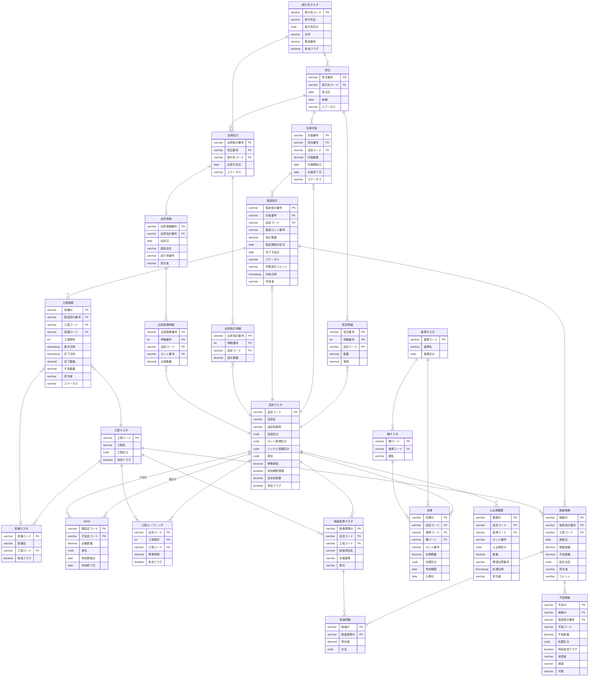

# 04. ER図

## エンティティ関連図

---

## テーブル一覧

### マスタテーブル

| テーブル名 | 説明 |
|-----------|------|
| m_items | 品目マスタ |
| m_partners | 取引先マスタ |
| m_processes | 工程マスタ |
| m_equipments | 設備マスタ |
| m_warehouses | 倉庫マスタ |
| m_locations | 棚マスタ |
| m_bom | BOM（部品表） |
| m_routings | 工程ルーティング |
| m_inspection_standards | 検査基準マスタ |

### トランザクションテーブル

| テーブル名 | 説明 |
|-----------|------|
| t_orders | 受注 |
| t_order_lines | 受注明細 |
| t_production_plans | 生産計画 |
| t_manufacturing_orders | 製造指示 |
| t_process_results | 工程実績 |
| t_inventories | 在庫 |
| t_inventory_histories | 入出庫履歴 |
| t_inspections | 検査実績 |
| t_inspection_lines | 検査明細 |
| t_defects | 不良情報 |
| t_shipment_orders | 出荷指示 |
| t_shipment_order_lines | 出荷指示明細 |
| t_shipment_results | 出荷実績 |
| t_shipment_result_lines | 出荷実績明細 |
