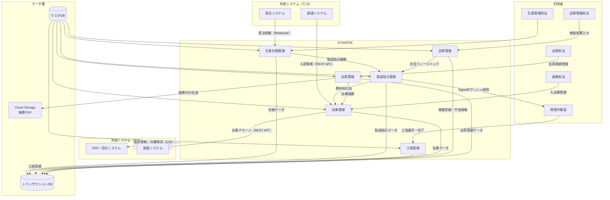
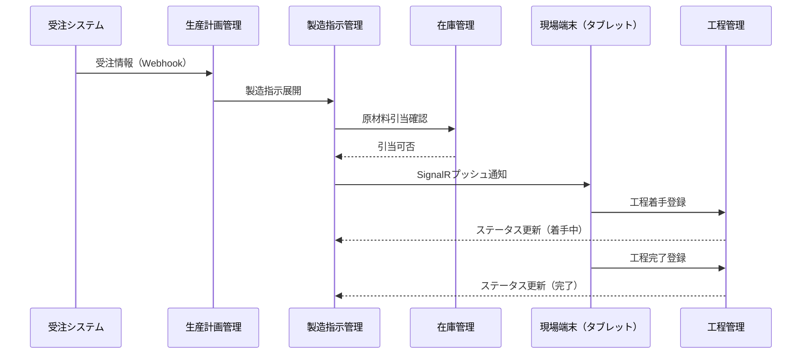
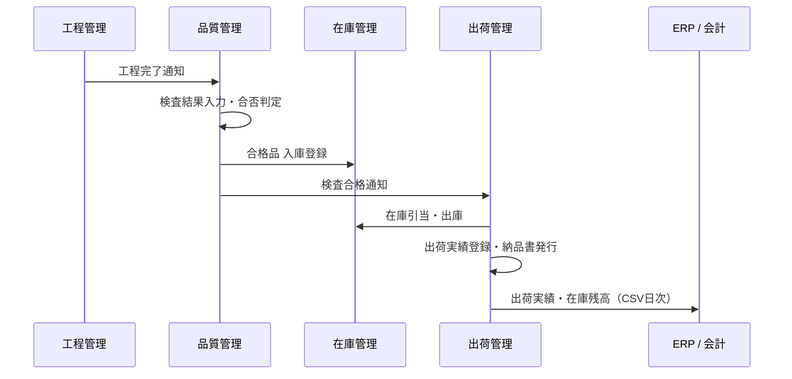

# 05. データフロー図

## システム全体のデータフロー

---

## 主要業務フロー別データフロー

### 製造指示〜工程完了

### 品質検査〜出荷

---

## データ連携一覧

| 連携 | 方向 | 方式 | タイミング | データ |
|------|------|------|-----------|--------|
| 受注システム → 本システム | 受信 | Webhook（REST API） | リアルタイム | 受注番号・品目・数量・納期 |
| 本システム → ERP / 会計 | 送信 | CSVファイル | 日次（22:00バッチ） | 製造実績・在庫残高・出荷実績 |
| 調達システム → 本システム | 受信 | REST API | リアルタイム | 入荷予定・入荷実績 |
| 本システム → 調達システム | 送信 | REST API | アラート発生時 | 原材料発注依頼 |
| 現場端末 → バックエンド | 送信 | REST API | 都度 | 工程実績・検査結果 |
| バックエンド → 現場端末 | 送信 | SignalR（WebSocket） | リアルタイム | 製造指示・進捗通知・アラート |
