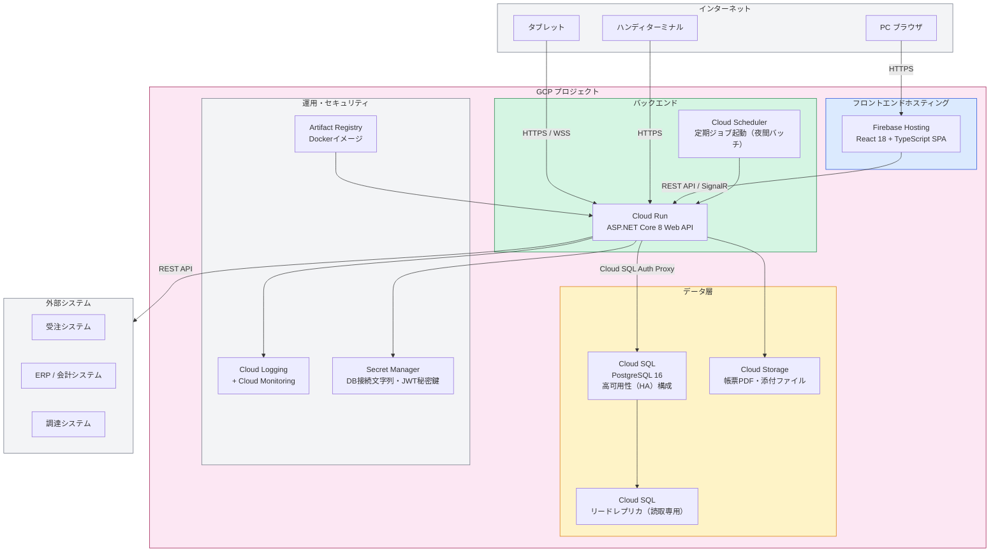

# 06. インフラ構成図

## GCPインフラ全体構成

---

## 構成要素一覧

### フロントエンド

| コンポーネント | サービス | 説明 |
|-------------|---------|------|
| Webホスティング | Firebase Hosting | React SPA のホスティング・CDN配信 |
| フレームワーク | React 18 + TypeScript | PC・タブレット・ハンディ対応レスポンシブ |
| UIライブラリ | shadcn/ui + Tailwind CSS | コンポーネントUI |
| リアルタイム | @microsoft/signalr | 工程進捗・アラートのプッシュ受信 |
| バーコードスキャン | @zxing/browser | カメラAPIでQR・バーコード読取 |

### バックエンド

| コンポーネント | サービス | 説明 |
|-------------|---------|------|
| APIサーバ | Cloud Run | ASP.NET Core 8 Web API コンテナ・オートスケール |
| リアルタイム配信 | SignalR Hub | 工程進捗・アラートのWebSocket配信 |
| バッチ処理 | Hangfire + Cloud Scheduler | 夜間バッチ・外部連携定期ジョブ |
| コンテナイメージ | Artifact Registry | Dockerイメージの管理 |

### データ層

| コンポーネント | サービス | 説明 |
|-------------|---------|------|
| RDBMS | Cloud SQL for PostgreSQL 16 | 本番：高可用性（HA）構成・自動フェイルオーバー |
| ファイルストレージ | Cloud Storage | 帳票PDF・添付ファイルの保管 |

### 運用・セキュリティ

| コンポーネント | サービス | 説明 |
|-------------|---------|------|
| 監視・ログ | Cloud Logging + Cloud Monitoring | 構造化ログ・アプリ死活監視・アラート |
| シークレット管理 | Secret Manager | DB接続文字列・JWT秘密鍵 |

---

## 環境構成

| 環境 | GCPプロジェクト | 用途 | デプロイトリガー |
|------|----------------|------|----------------|
| ローカル開発 | - | 開発・単体テスト（Docker Compose） | 手動 |
| 開発環境（クラウド） | mfg-sys-dev | チーム共有・統合確認 | mainマージで自動 |
| ステージング環境 | mfg-sys-stg | 結合テスト・UAT | release/*マージで自動 |
| 本番環境 | mfg-sys-prod | 本番稼働 | タグ付与・手動承認後 |

---

## ネットワーク要件

| 場所 | 要件 |
|------|------|
| 事務所 | 有線LAN（インターネット接続必須） |
| 製造現場 | 無線LAN（Wi-Fi 6推奨・タブレット接続） |
| 倉庫 | 無線LAN（Wi-Fi 5以上・ハンディターミナル対応） |

---

## バックアップ・DR方針

| 項目 | 内容 |
|------|------|
| バックアップ頻度 | 日次自動バックアップ・7世代保管 |
| ポイントインタイムリカバリ | Cloud SQL PITR（本番環境） |
| フェイルオーバー | Cloud SQL HA構成による自動フェイルオーバー |
| Cloud Runスケール | リクエスト数に応じた自動スケールアウト |
