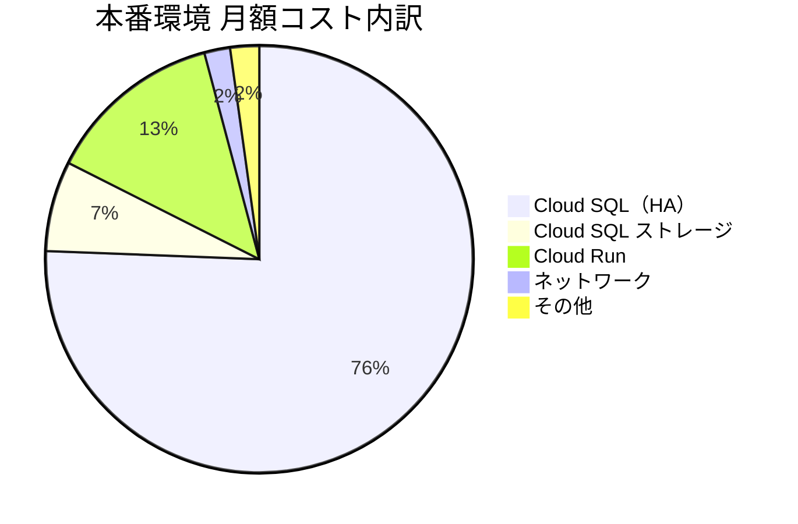

# 07. GCP月額料金見積もり

## 前提条件

| 項目 | 内容 |
|------|------|
| リージョン | asia-northeast1（東京） |
| 環境数 | ローカル開発 / 本番 の2環境 |
| 同時接続ユーザー数 | 通常 20〜30名、ピーク 40名 |
| 稼働時間 | 平日 6:00〜22:00（16h）、土曜 6:00〜18:00（12h）≈ 400h/月 |
| 為替レート | 1USD = ¥150 |

---

## 本番環境（mfg-sys-prod）

| サービス | 構成 | 月額（概算） |
|---------|------|------------|
| Cloud Run | 1vCPU / 1GB RAM / ウォームインスタンス 1台 | ¥5,500 |
| Cloud SQL（HA） | db-custom-2-7680（2vCPU・7.5GB RAM）+ HA構成 | ¥31,000 |
| Cloud SQL ストレージ | SSD 100GB + 自動バックアップ 7世代 | ¥2,800 |
| Firebase Hosting | React SPA（無料枠内） | ¥0 |
| Cloud Storage | 帳票PDF・添付ファイル 100GB | ¥300 |
| Cloud Logging / Monitoring | 50GB / 月 無料枠内 | ¥0〜500 |
| Secret Manager | DBパスワード・JWT秘密鍵 | ¥100 |
| Artifact Registry | Dockerイメージ 5GB | ¥400 |
| Cloud Scheduler | 3ジョブ以内（無料枠） | ¥0 |
| ネットワーク送信 | 外部通信 約50GB / 月 | ¥800 |
| **小計** | | **約 ¥41,000** |

---

## 合計

| 環境 | 月額（概算） |
|------|------------|
| 本番（mfg-sys-prod） | ¥41,000 |
| ローカル開発 | ¥0（GCP費用なし） |
| **合計** | **約 ¥41,000 / 月** |

> ※ 為替・GCP価格改定により変動あり。
> ※ Cloud SQL（HA構成）が全体コストの約60%を占めます。
> ※ トラフィック・データ量増加に応じてCloud RunおよびCloud Storageのコストが増加します。

---

## コスト内訳（本番環境）

---

## コスト削減オプション

| 施策 | 削減効果 | 影響 |
|------|---------|------|
| 本番 Cloud SQL HA構成を外す | ▲¥15,000/月 | 可用性・自動フェイルオーバーが無効になる（非推奨） |
| Cloud Run 最小インスタンス数を0に変更（本番） | ▲¥2,000/月 | ピーク時にコールドスタートが発生 |

### 削減後の試算（推奨パターン）

| 施策 | 月額（概算） |
|------|------------|
| 現状（HA構成維持） | ¥41,000 |
| Cloud Run ゼロスケール化のみ | ¥39,000 |
