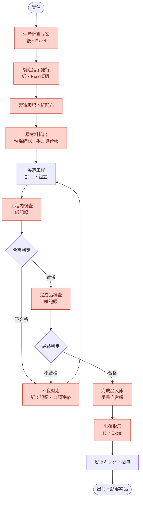
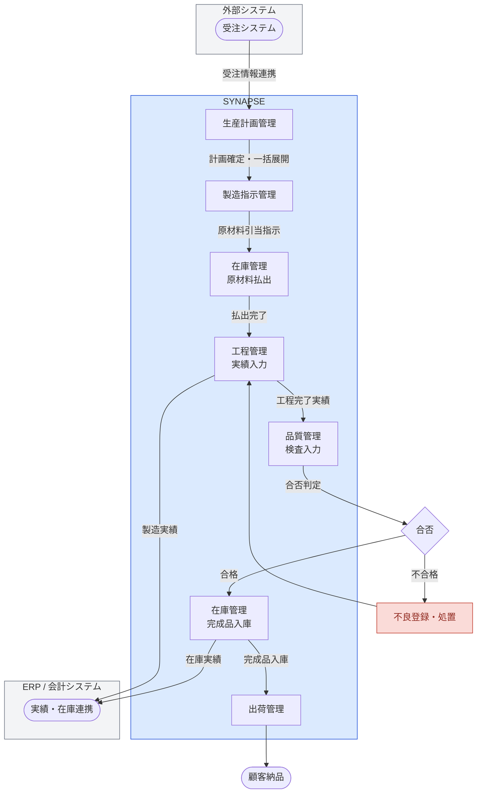

# 02. 業務要件

## 2.1 現状業務フロー

### 全体業務フロー（AS-IS）

> 赤色：課題・非効率が発生している箇所
> 詳細フローは [08_業務フロー図](./08_業務フロー図.md) を参照

---

### 典型的な1日の業務シナリオ（AS-IS）

#### 朝：生産計画〜製造指示

1. 生産管理担当（8:00）が受注システムの画面を見ながら、Excelの生産計画表に**手入力**で受注情報を転記する。受注件数が多い日は転記だけで **30〜40分** かかる。
2. Excelで計画を確認・調整後、製造指示書をA4用紙に印刷。**1ライン分で10〜20枚**になることもある。
3. 現場リーダーが事務所に取りに来るか、担当者が現場まで配布する（片道 **5〜10分**）。

#### 午前：製造開始〜進捗確認

4. 現場作業員は紙の製造指示書を見ながら作業を開始。工程が完了するたびに**紙の進捗欄に手書きで時刻・数量を記入**する。
5. 生産管理担当が進捗を確認したい場合は**現場に電話または直接歩いて確認**しに行く必要がある。リアルタイムの進捗は把握不可。
6. 原材料の在庫が足りるか不安になった作業員が倉庫担当に電話 → 倉庫担当が台帳を確認 → 折り返し電話、という往復で **15〜20分** ロス。

#### 午後：変更対応〜品質問題

7. 顧客から**納期変更・数量変更**の連絡が入る（週3〜4回程度発生）。生産管理担当が新しい製造指示書を印刷し、現場に走って**古い指示書と差し替える**。差し替えが間に合わず旧指示書のまま製造してしまう事故が**月2〜3件**発生している。
8. 工程内検査で不良が発覚。現場リーダーが品質管理担当を口頭で呼ぶ。品質担当が過去の類似不良を調べるため、**紙のファイルを棚から探す作業に20〜30分**かかる。

#### 夕方：完成品入庫〜出荷準備

9. 完成品入庫時、倉庫担当が手書き台帳に品目・数量・ロット番号を記入。記入漏れや誤記が**月5〜10件**発生。
10. 翌日の出荷準備のため、出荷担当が複数のExcelファイルを突き合わせながら出荷指示書を作成。**納品書の手作成に1件あたり10〜15分**かかる。

---

## 2.2 現状の課題

| # | 課題 | 具体的な発生状況 | 影響 | 頻度・規模 | 優先度 |
|---|------|----------------|------|-----------|--------|
| 1 | 製造指示の変更伝達が遅れる | 顧客都合の変更を口頭・電話で現場に伝達しており、旧指示書のまま製造してしまう | 誤製造・手直し・廃棄ロス | 月2〜3件の誤製造事故 | 高 |
| 2 | 工程進捗がリアルタイムに把握できない | 現場に行かないと進捗不明。遅延に気づくのが当日の夕方になることがある | 納期遅延の早期対応不可 | 月1〜2回の納期調整連絡 | 高 |
| 3 | 不良発生時の原因分析に時間がかかる | 紙ファイルの検索に時間がかかり、類似不良の再発防止が遅れる | 不良の再発・クレーム対応コスト増 | 不良分析1件あたり半日〜1日 | 高 |
| 4 | 在庫数量の把握に時間がかかる | 台帳が最新化されておらず、正確な在庫数は倉庫で目視確認が必要 | 欠品による製造停止、過剰在庫の発生 | 月3〜5回の製造停止（欠品起因） | 高 |
| 5 | ロット単位のトレーサビリティが取れない | 使用原材料ロットと完成品の紐付けが紙管理のため、追跡に1〜2日かかる | リコール・クレーム時の影響範囲特定が困難 | 年1〜2回のクレーム対応で発生 | 高 |
| 6 | Excelへの手入力・転記工数が多い | 受注→生産計画→製造指示→台帳と複数回の転記が発生。ミスも多い | 無駄な工数・転記ミスによるトラブル | 生産管理担当1名の業務時間の約30%が転記作業 | 中 |
| 7 | 設備の稼働状況が見えない | 設備停止が発生しても管理者が気づくまでに時間がかかる | 停止時間の長期化、生産計画の乱れ | 月2〜3回の長時間停止 | 中 |
| 8 | 出荷誤りが発生する | 複数顧客・複数品目の出荷指示をExcelで管理しており、取り違えが起きる | 誤出荷クレーム、返品対応コスト | 年3〜5件の誤出荷 | 中 |

---

## 2.3 目標業務フロー（TO-BE）

### 全体業務フロー（TO-BE）

> 詳細フローは [08_業務フロー図](./08_業務フロー図.md) を参照

### 改善後の業務イメージ（TO-BE）

- **受注情報は自動連携**：受注システムから本システムへデータが自動取込され、手入力・転記ゼロ。
- **製造指示はタブレットへ即時配信**：発行・変更はシステム上で完結。現場タブレットに即時反映され、旧指示書の差し替え作業が不要。
- **進捗はダッシュボードでリアルタイム確認**：各工程の着手・完了実績が入力されると、事務所のPCからリアルタイムに確認可能。
- **品質情報はその場で電子入力**：検査結果をタブレットで入力。過去の類似不良もシステム検索で即座に参照可能。
- **在庫はシステムで即時確認**：入出庫のたびに在庫が更新され、安全在庫を下回ると自動アラート。
- **トレーサビリティは自動構築**：原材料ロット〜完成品〜出荷先まで、システムが自動的に紐付けを管理。

---

## 2.4 業務改善目標（KPI）

| KPI | 現状 | 目標 | 計測方法 |
|-----|------|------|---------|
| 製造指示の伝達時間（発行〜現場確認） | 30分以上（印刷・配布） | 5分以内（自動配信） | システムの発行時刻〜現場確認時刻の差 |
| 工程進捗の可視化タイムラグ | 1〜2時間（現場確認が必要） | 5分以内（リアルタイム） | 実績入力時刻と管理者参照時刻の差 |
| 品質不良の原因分析時間 | 半日〜1日 | 1時間以内 | 不良発生報告〜原因特定報告の経過時間 |
| 在庫照会の所要時間 | 15〜30分（倉庫確認） | 1分以内（システム参照） | 照会要求〜回答完了の経過時間 |
| トレーサビリティ追跡時間 | 1〜2日 | 30分以内 | 追跡依頼〜追跡結果報告の経過時間 |
| 製造指示変更起因の誤製造件数 | 月2〜3件 | 月0件 | システムの変更ログと誤製造報告の照合 |
| 生産管理担当の転記・手入力工数 | 業務時間の約30% | 5%以下 | 月次業務工数報告 |
| 誤出荷件数 | 年3〜5件 | 年0件 | 出荷実績と返品受付記録の照合 |

---

## 2.5 業務ルール

システム化にあたって遵守すべき、製造業務上の重要なルールを定義する。

### 製造指示に関するルール

| # | ルール | 詳細 |
|---|--------|------|
| BR-MO-001 | 製造指示なしの製造着手禁止 | システムで発行済みの製造指示が存在しない場合、工程着手登録ができないこと |
| BR-MO-002 | 工程順序のスキップ禁止 | 工程ルーティングで定義された順序を飛ばして次工程に進むことはできない（前工程の完了が次工程着手の前提） |
| BR-MO-003 | 製造指示の変更権限 | 製造指示の変更は生産管理担当以上の権限を持つユーザーのみ実施可能。着手中の場合は完了予定日と作業コメントのみ変更可 |
| BR-MO-004 | 完了済み指示の変更禁止 | ステータスが「完了」または「キャンセル」の製造指示は変更・キャンセル不可 |

### 品質管理に関するルール

| # | ルール | 詳細 |
|---|--------|------|
| BR-QC-001 | 出荷前最終検査の必須化 | 完成品は最終検査で「合格」判定を受けるまで出荷指示を確定できない |
| BR-QC-002 | 特採の承認必須 | 検査不合格品の「特採（条件付き使用承認）」は品質管理責任者の承認が必要 |
| BR-QC-003 | 不良品の在庫区分変更 | 不良品が発生した場合、在庫区分を「保留在庫」または「廃棄在庫」に変更し、通常出庫不可にする |
| BR-QC-004 | ロット単位のトレーサビリティ必須 | 原材料ロット番号と製造ロット番号は必ず紐付けて記録すること |

### 在庫管理に関するルール

| # | ルール | 詳細 |
|---|--------|------|
| BR-INV-001 | 先入れ先出し（FIFO）の原則 | 同一品目の払出はロット入庫日の古いものから優先して行う |
| BR-INV-002 | マイナス在庫の禁止 | 払出数量が引当可能在庫を超える場合、システムがエラーを返し出庫不可とする |
| BR-INV-003 | 棚卸期間中の通常出庫禁止 | 棚卸開始宣言後は、棚卸完了・承認まで通常の出庫操作を受け付けない |
| BR-INV-004 | 有効期限管理品目の期限切れアラート | 有効期限が設定された品目は、期限の30日前からアラート通知を行う |

### 出荷に関するルール

| # | ルール | 詳細 |
|---|--------|------|
| BR-SH-001 | 出荷前検査合格確認 | 完成品検査が「合格」となっていない製品の出荷実績登録はできない |
| BR-SH-002 | 出荷数量の上限制御 | 出荷実績の数量が出荷指示の数量を超える場合はエラーとする（分割出荷は指示数量の範囲内） |
| BR-SH-003 | 出荷ロット確定 | 出荷実績登録時に出荷するロット番号を確定し、トレーサビリティレコードとして記録する |

---

## 2.6 利用者・利用環境

| 利用者区分 | 人数（想定） | 主な利用機能 | 利用端末 | 利用場所 | 利用頻度 |
|-----------|------------|------------|---------|---------|---------|
| 生産管理担当 | 3名 | 生産計画、製造指示発行・変更、進捗モニタリング | PC | 事務所 | 終日（常時） |
| 製造現場リーダー | 5名（ライン数分） | 製造指示確認・着手、工程完了登録、不良報告 | タブレット | 製造現場 | 終日（作業中） |
| 製造作業員 | 20名 | 工程実績入力、製造指示参照 | タブレット・ハンディ | 製造現場 | 作業都度 |
| 品質管理担当 | 3名 | 検査結果入力、不良登録・処置、品質分析 | PC・タブレット | 検査場・事務所 | 終日（常時） |
| 倉庫担当 | 4名 | 入出庫登録、在庫照会、棚卸 | ハンディターミナル | 倉庫 | 終日（作業都度） |
| 出荷担当 | 2名 | 出荷指示確定、ピッキング、納品書発行 | PC・ハンディ | 出荷場・事務所 | 終日（常時） |
| 管理職 | 5名 | ダッシュボード・KPIモニタリング、承認操作 | PC | 事務所 | 1日数回 |
| システム管理者 | 1名 | マスタ管理、ユーザー・権限管理 | PC | 事務所 | 随時 |

**同時接続ユーザー数の想定：**

| 時間帯 | 同時接続数（想定） |
|--------|-----------------|
| 通常時（日中） | 20〜30名 |
| ピーク時（朝の製造開始・夕方の完了集中） | 最大40名 |
| 夜間・休日 | 1〜5名（保守・緊急確認） |

---

## 2.7 外部システム連携要件

| 連携先システム | 連携方向 | 連携データ | 連携方式 | タイミング | 優先度 |
|--------------|---------|-----------|---------|-----------|--------|
| 受注システム | 受注 → 本システム | 受注番号・顧客・品目・数量・納期 | API（REST） | 受注登録時リアルタイム | 必須 |
| ERP / 会計システム | 本システム → ERP | 製造実績・在庫残高・出荷実績 | ファイル連携（CSV） | 日次バッチ（22:00） | 必須 |
| 調達システム | 本システム → 調達 | 原材料発注依頼（在庫アラート起点） | API（REST） | アラート発生時リアルタイム | 推奨 |
| 調達システム | 調達 → 本システム | 入荷予定・入荷実績 | API（REST） | 入荷登録時リアルタイム | 推奨 |

> ※ 連携方式・詳細仕様は [05_システム構成](./05_システム構成.md) を参照
