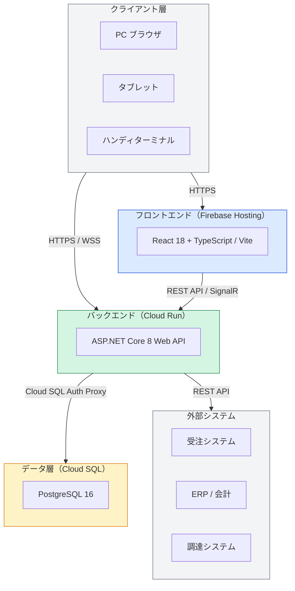

# 05. システム構成

## 5.1 システムアーキテクチャ概要

> 詳細な技術スタック・開発環境は [10_技術スタック・開発環境](./10_技術スタック・開発環境.md) を参照

## 5.2 システム構成要素

| 構成要素 | 採用技術 | 備考 |
|---------|---------|------|
| フロントエンド | React 18 + TypeScript（Vite） | PC・タブレット・ハンディ対応レスポンシブ |
| バックエンド | ASP.NET Core 8 Web API（C#） | REST API + SignalR（リアルタイム） |
| データベース | PostgreSQL 16（Cloud SQL） | EF Core 8 + Npgsql で接続 |
| Webサーバ | Cloud Run（GCP） | コンテナ化・オートスケール |
| 認証基盤 | ASP.NET Identity + JWT Bearer | RBAC（ロールベースアクセス制御） |
| バッチ処理基盤 | Hangfire + Cloud Scheduler | 夜間バッチ・定期連携ジョブ |
| ファイルストレージ | Cloud Storage（GCP） | 帳票PDF・添付ファイル保管 |
| リアルタイム通信 | SignalR（WebSocket） | 工程進捗・アラートのプッシュ通知 |

## 5.3 インフラ構成（GCP）

| 項目 | 内容 |
|------|------|
| クラウド | Google Cloud Platform（GCP） |
| フロントエンドホスティング | Firebase Hosting |
| バックエンドホスティング | Cloud Run（サーバーレスコンテナ） |
| データベース | Cloud SQL for PostgreSQL（高可用性HA構成） |
| ファイルストレージ | Cloud Storage |
| コンテナレジストリ | Artifact Registry |
| 監視・ログ | Cloud Logging + Cloud Monitoring |
| シークレット管理 | Secret Manager（DBパスワード・JWT秘密鍵） |
| 定期実行 | Cloud Scheduler |
| 冗長構成 | Cloud Run：自動スケール / Cloud SQL：HAフェイルオーバー |
| バックアップ | 日次自動バックアップ、7世代保管（Cloud SQL） |
| 災害対策 | Cloud SQL ポイントインタイムリカバリ（PITR） |

## 5.4 外部システム連携

| 連携先 | 連携方向 | 連携データ | 連携方式 | タイミング |
|-------|---------|-----------|---------|-----------|
| 受注システム | 受注 → 本システム | 受注情報（受注番号・品目・数量・納期） | REST API（Webhook受信） | 受注登録時リアルタイム |
| ERP / 会計システム | 本システム → ERP | 在庫実績・製造実績 | CSVファイル連携 | 日次バッチ（22:00） |
| 調達システム | 双方向 | 発注情報・入荷情報 | REST API | リアルタイム |

## 5.5 ネットワーク要件

| 場所 | 要件 |
|------|------|
| 事務所 | 有線LAN（インターネット接続必須） |
| 製造現場 | 無線LAN（Wi-Fi 6推奨、タブレット接続） |
| 倉庫 | 無線LAN（Wi-Fi 5以上、ハンディターミナル対応） |

## 5.6 開発・テスト環境

| 環境 | GCPプロジェクト | 用途 | デプロイトリガー |
|------|----------------|------|----------------|
| ローカル開発 | - | 開発・単体テスト（Docker Compose） | 手動 |
| 開発環境（クラウド） | mfg-sys-dev | チーム共有・統合確認 | main マージで自動 |
| ステージング環境 | mfg-sys-stg | 結合テスト・UAT | release/* マージで自動 |
| 本番環境 | mfg-sys-prod | 本番稼働 | タグ付与・手動承認後 |
