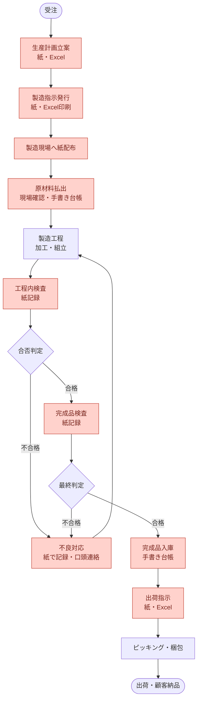
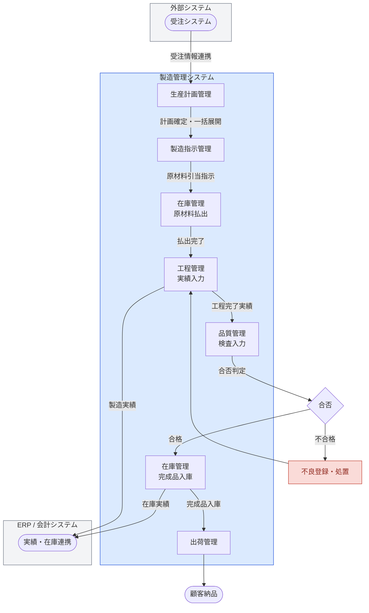
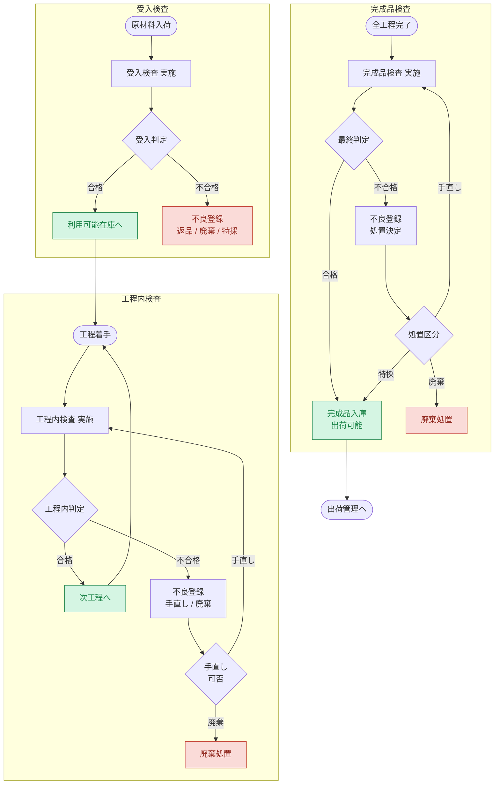
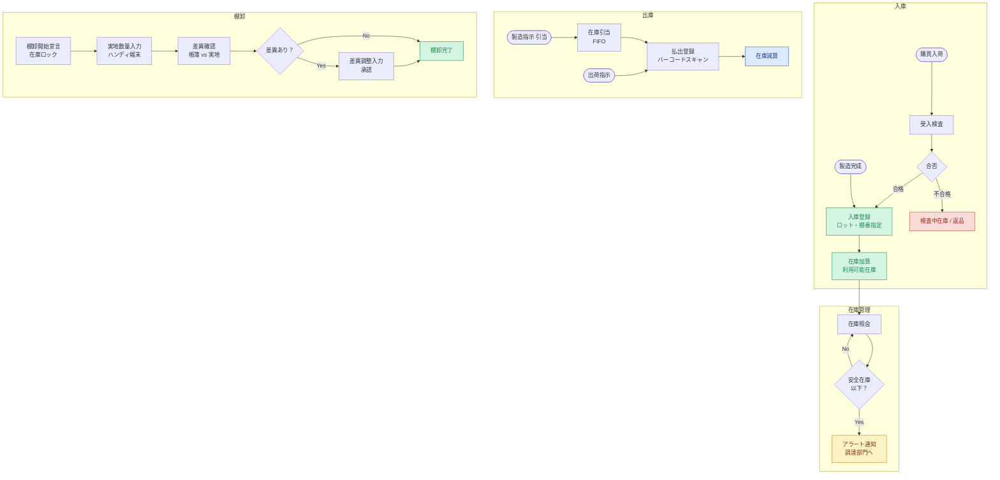
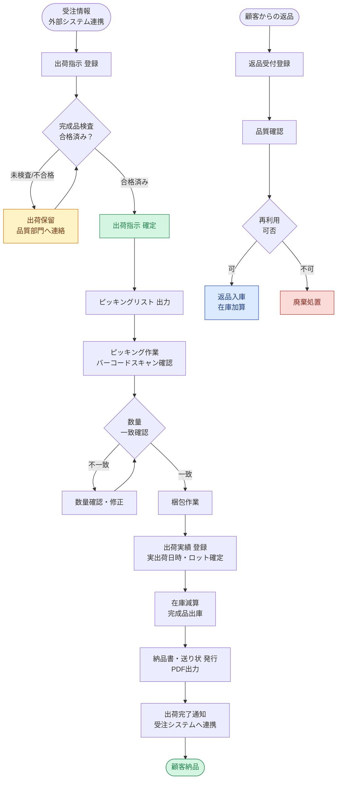
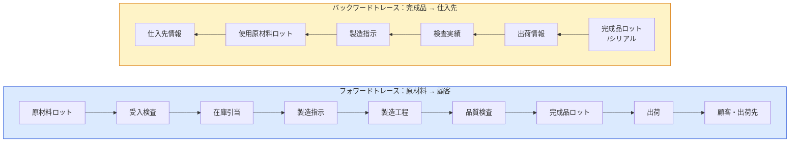

# 08. 業務フロー図

## カラー凡例

| 色 | 意味 |
|----|------|
| 薄サーモン | 課題・非効率が発生している箇所（AS-IS） |
| 薄緑 | 合格・完了・成功 |
| 薄黄 | 警告・注意・保留 |
| 薄青 | システム処理・情報 |
| 薄赤 | 不合格・廃棄・キャンセル |

---

## 8.1 全体業務フロー（AS-IS：現状）



---

## 8.2 全体業務フロー（TO-BE：新システム導入後）



---

## 8.3 製造指示管理フロー

```mermaid
flowchart TD
    A([生産計画 確定]) --> B["製造指示 一括展開<br/>/手動作成"]
    B --> C{在庫引当<br/>確認}
    C -- "在庫不足<br/>警告あり" --> D["警告表示<br/>※発行は可能"]
    C -- 在庫OK --> E[製造指示 発行]
    D --> E
    E --> F["製造指示番号 採番<br/>MO-YYYYMMDD-NNNN"]
    F --> G["現場端末へ通知<br/>タブレット配信"]

    G --> H{現場担当者<br/>確認}
    H -- 着手 --> I["工程着手登録<br/>着手中ステータス"]
    I --> J[製造作業]
    J --> K["工程完了登録<br/>実績数量入力"]
    K --> L{全工程<br/>完了？}
    L -- No --> J
    L -- Yes --> M["製造指示 完了<br/>完成品入庫へ"]

    subgraph 変更・キャンセル
        N["製造指示 変更<br/>未着手のみ数量変更可"]
        O["製造指示 キャンセル<br/>未着手・着手中のみ"]
    end

    E -.-> N
    E -.-> O

    style D fill:#fef3c7,stroke:#d97706,color:#78350f
    style E fill:#d5f5e3,stroke:#1e8449,color:#1e8449
    style M fill:#d5f5e3,stroke:#1e8449,color:#1e8449
    style N fill:#dbeafe,stroke:#1d4ed8,color:#1e3a8a
    style O fill:#fadbd8,stroke:#c0392b,color:#922b21
```

---

## 8.4 品質管理フロー



---

## 8.5 在庫管理フロー（入出庫）



---

## 8.6 出荷管理フロー



---

## 8.7 トレーサビリティ追跡フロー


