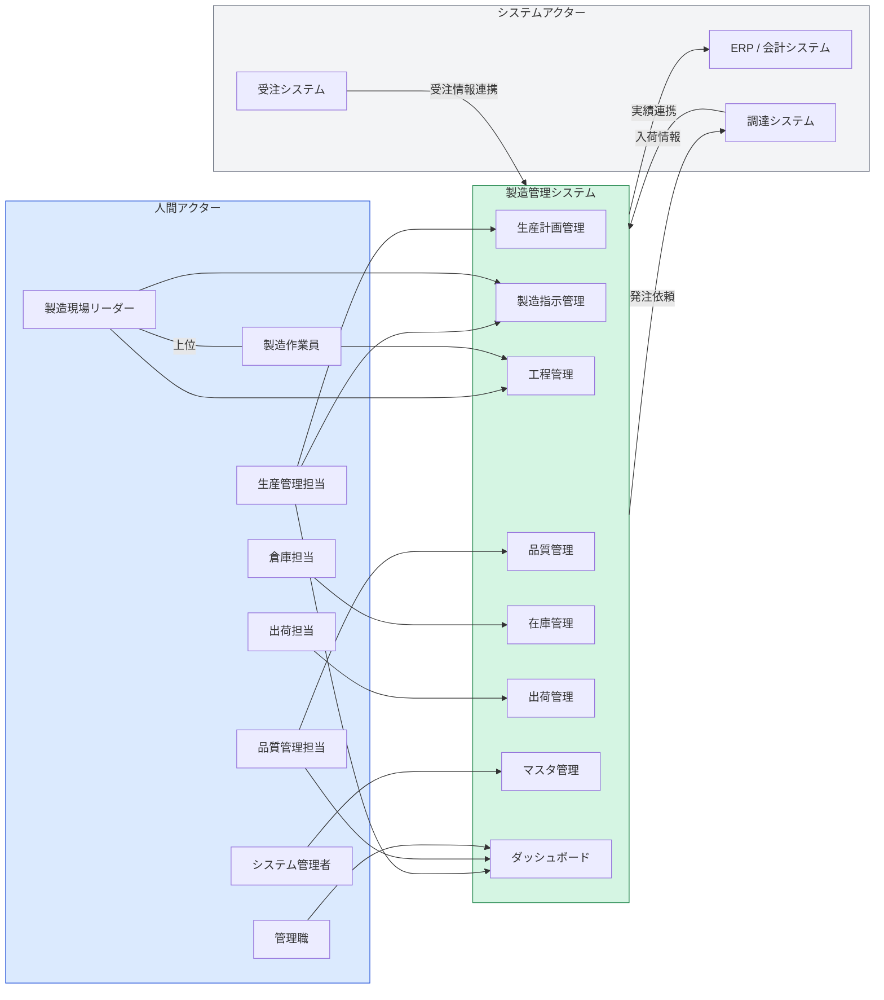

# 09. アクター定義

## 9.1 アクター概要

本システムに関わるアクターを「人間アクター」と「システムアクター」に分類して定義する。

---

## 9.2 人間アクター定義

### A1. システム管理者

| 項目 | 内容 |
|------|------|
| 概要 | システム全体の設定・マスタ・ユーザー管理を担う |
| 主な目的 | システムが正常に稼働し続けること、マスタデータが正確に保たれること |
| 所属部門 | 情報システム部門 または IT管理担当 |
| 人数 | 1〜2名 |
| 権限レベル | 最上位（全機能アクセス可、マスタ・権限管理可） |
| 主な操作 | ユーザー登録・権限設定、品目・工程・設備マスタ管理、システム設定変更 |
| 利用端末 | PC |
| 利用場所 | 事務所 |

---

### A2. 生産管理担当

| 項目 | 内容 |
|------|------|
| 概要 | 受注情報をもとに生産計画を立案し、製造指示を発行・管理する |
| 主な目的 | 納期通りに製品を製造・出荷できるよう計画し、現場をコントロールすること |
| 所属部門 | 生産管理部門 |
| 人数 | 3名 |
| 権限レベル | 高（生産計画・製造指示の作成・変更・承認が可能） |
| 主な操作 | 生産計画作成・確定、製造指示発行・変更・キャンセル、進捗ダッシュボード確認 |
| 利用端末 | PC |
| 利用場所 | 事務所 |
| 特記事項 | 変更権限を持つ唯一のアクター（製造指示の数量変更等） |

---

### A3. 製造現場リーダー

| 項目 | 内容 |
|------|------|
| 概要 | 製造ラインを統括し、製造指示を受けて工程着手・完了を管理する |
| 主な目的 | 担当ラインの製造指示を滞りなく完了させること、問題発生時に迅速に対処すること |
| 所属部門 | 製造部門（ライン・班ごと） |
| 人数 | 5名（ライン数分） |
| 権限レベル | 中（工程実績登録・製造指示参照が可能。発行・変更は不可） |
| 主な操作 | 製造指示確認・着手操作、工程完了登録、不良報告、作業員への指示 |
| 利用端末 | タブレット（製造現場設置） |
| 利用場所 | 製造現場 |
| 特記事項 | A4（製造作業員）の上位アクター。作業員が登録できない操作はリーダーが代行する |

---

### A4. 製造作業員

| 項目 | 内容 |
|------|------|
| 概要 | 製造指示に従い実際の製造作業を行い、工程実績を入力する |
| 主な目的 | 担当工程の作業を正確・迅速に完了し、実績をシステムに記録すること |
| 所属部門 | 製造部門 |
| 人数 | 20名 |
| 権限レベル | 低（自分が担当する工程の実績入力のみ） |
| 主な操作 | 工程着手登録（バーコードスキャン）、工程完了・数量入力、製造指示参照 |
| 利用端末 | タブレット・ハンディターミナル |
| 利用場所 | 製造現場（各工程） |
| 特記事項 | バーコード・QRスキャンで製造指示を特定して着手する運用を想定 |

---

### A5. 品質管理担当

| 項目 | 内容 |
|------|------|
| 概要 | 受入・工程内・完成品の検査を実施し、品質情報を管理する |
| 主な目的 | 不良品の流出を防ぎ、品質情報を蓄積して改善活動に活用すること |
| 所属部門 | 品質管理部門 |
| 人数 | 3名（うち1名が責任者） |
| 権限レベル | 中〜高（検査登録・不良登録・特採承認が可能） |
| 主な操作 | 受入検査・工程内検査・完成品検査の入力、不良登録・処置決定、トレーサビリティ照会、特採承認（責任者のみ） |
| 利用端末 | PC（検査場・事務所）、タブレット（現場検査時） |
| 利用場所 | 検査場・事務所 |
| 特記事項 | 特採（不合格品の条件付き使用承認）は品質管理責任者のみが操作可能 |

---

### A6. 倉庫担当

| 項目 | 内容 |
|------|------|
| 概要 | 原材料・仕掛品・完成品の入出庫・在庫管理・棚卸を担う |
| 主な目的 | 在庫情報を正確に管理し、必要なものを必要なタイミングで供給すること |
| 所属部門 | 物流・倉庫部門 |
| 人数 | 4名 |
| 権限レベル | 中（在庫入出庫・棚卸操作が可能） |
| 主な操作 | 入庫登録（バーコードスキャン）、出庫登録・払出、在庫照会・移動、棚卸入力 |
| 利用端末 | ハンディターミナル（倉庫内）、PC（事務所） |
| 利用場所 | 倉庫 |
| 特記事項 | ハンディターミナルによるスキャン操作がメインのため、画面は簡易UI（大きなボタン・最小限の入力項目）が必要 |

---

### A7. 出荷担当

| 項目 | 内容 |
|------|------|
| 概要 | 出荷指示をもとにピッキング・梱包・出荷実績登録・納品書発行を行う |
| 主な目的 | 正確な品目・数量・ロットを指定された顧客に納期通り出荷すること |
| 所属部門 | 物流・出荷部門 |
| 人数 | 2名 |
| 権限レベル | 中（出荷指示確定・出荷実績登録・帳票発行が可能） |
| 主な操作 | 出荷指示確認・確定、ピッキングリスト出力、出荷実績登録、納品書・送り状発行 |
| 利用端末 | PC（出荷場事務所）、ハンディターミナル（ピッキング作業） |
| 利用場所 | 出荷場・事務所 |
| 特記事項 | 完成品検査「合格」済みでない製品の出荷確定はシステムでブロックされる |

---

### A8. 管理職

| 項目 | 内容 |
|------|------|
| 概要 | 製造・品質・在庫・出荷のKPIをモニタリングし、経営判断・承認を行う |
| 主な目的 | 現場の状況をリアルタイムに把握し、問題の早期検知と意思決定を行うこと |
| 所属部門 | 製造部門・品質部門・物流部門の管理職（部長・課長クラス） |
| 人数 | 5名 |
| 権限レベル | 参照高・操作低（ダッシュボード参照・一部承認操作が可能。データ入力は基本不可） |
| 主な操作 | 生産進捗ダッシュボード閲覧、KPIレポート確認、特採承認（委任された場合） |
| 利用端末 | PC |
| 利用場所 | 事務所 |

---

## 9.3 システムアクター定義

### S1. 受注システム

| 項目 | 内容 |
|------|------|
| 概要 | 顧客からの受注を管理する既存システム |
| 連携内容 | 受注情報（受注番号・顧客・品目・数量・納期）を本システムへ送信 |
| 連携方式 | REST API（本システムが受信エンドポイントを提供） |
| タイミング | 受注登録・変更時にリアルタイム連携 |

### S2. ERP / 会計システム

| 項目 | 内容 |
|------|------|
| 概要 | 財務・原価計算を管理する既存ERPシステム |
| 連携内容 | 製造実績・在庫残高・出荷実績を受信し、原価計算・会計処理に利用 |
| 連携方式 | CSVファイル連携（本システムが生成したファイルを取込） |
| タイミング | 日次バッチ（22:00） |

### S3. 調達システム

| 項目 | 内容 |
|------|------|
| 概要 | 原材料・部品の発注・入荷を管理する既存システム |
| 連携内容 | ①本システム→調達：在庫アラート発生時に発注依頼を送信 ②調達→本システム：入荷予定・入荷実績を受信 |
| 連携方式 | REST API（双方向） |
| タイミング | リアルタイム（アラート・入荷登録イベント起点） |

---

## 9.4 権限マトリクス

凡例：**○** 実行可 ／ **参照** 参照のみ ／ **-** 権限なし ／ **※** 条件付き可

| 機能 | A1 SYS管理者 | A2 生産管理 | A3 現場リーダー | A4 作業員 | A5 品質管理 | A6 倉庫 | A7 出荷 | A8 管理職 |
|------|:-:|:-:|:-:|:-:|:-:|:-:|:-:|:-:|
| **生産計画**　作成・変更 | ○ | ○ | - | - | - | - | - | - |
| **生産計画**　参照 | ○ | ○ | 参照 | - | - | - | - | 参照 |
| **製造指示**　発行・変更 | ○ | ○ | - | - | - | - | - | - |
| **製造指示**　参照 | ○ | ○ | 参照 | 参照 | 参照 | - | - | 参照 |
| **工程実績**　着手・完了登録 | ○ | - | ○ | ○ | - | - | - | - |
| **工程実績**　参照 | ○ | ○ | ○ | 参照 | 参照 | - | - | 参照 |
| **検査**　入力 | ○ | - | - | - | ○ | - | - | - |
| **不良**　登録・処置 | ○ | - | - | - | ○ | - | - | - |
| **特採**　承認 | ○ | - | - | - | ※責任者のみ | - | - | ※委任時 |
| **在庫**　入庫登録 | ○ | - | - | - | - | ○ | - | - |
| **在庫**　出庫・払出 | ○ | - | - | - | - | ○ | ○ | - |
| **在庫**　照会 | ○ | ○ | 参照 | - | 参照 | ○ | 参照 | 参照 |
| **棚卸** | ○ | - | - | - | - | ○ | - | - |
| **出荷指示**　確定・登録 | ○ | ○ | - | - | - | - | ○ | - |
| **出荷実績**　登録 | ○ | - | - | - | - | - | ○ | - |
| **納品書**　発行 | ○ | - | - | - | - | - | ○ | - |
| **ダッシュボード**　参照 | ○ | ○ | 参照 | - | 参照 | - | - | ○ |
| **マスタ**　管理 | ○ | - | - | - | - | - | - | - |
| **ユーザー・権限**　管理 | ○ | - | - | - | - | - | - | - |

---

## 9.5 アクターと主要ユースケースの対応

| ユースケース | A2 生産管理 | A3 現場L | A4 作業員 | A5 品質 | A6 倉庫 | A7 出荷 | A8 管理職 |
|------------|:-:|:-:|:-:|:-:|:-:|:-:|:-:|
| 生産計画を立案する | 主 | - | - | - | - | - | - |
| 製造指示を発行する | 主 | - | - | - | - | - | - |
| 製造指示を変更する | 主 | - | - | - | - | - | - |
| 工程に着手する | 副 | 主 | 主 | - | - | - | - |
| 工程実績を入力する | - | 主 | 主 | - | - | - | - |
| 検査結果を入力する | - | - | - | 主 | - | - | - |
| 不良を登録・処置する | - | - | - | 主 | - | - | - |
| 原材料を入庫する | - | - | - | - | 主 | - | - |
| 原材料を払い出す | - | - | - | - | 主 | - | - |
| 在庫を照会する | 副 | - | - | 副 | 主 | 副 | 副 |
| 棚卸を実施する | - | - | - | - | 主 | - | - |
| 出荷指示を確定する | 副 | - | - | - | - | 主 | - |
| 出荷実績を登録する | - | - | - | - | - | 主 | - |
| 納品書を発行する | - | - | - | - | - | 主 | - |
| 進捗をモニタリングする | 副 | 副 | - | 副 | - | - | 主 |
| トレーサビリティを追跡する | 副 | - | - | 主 | - | - | 副 |

> 主：主要アクター（そのユースケースを起動・主体的に実行する） ／ 副：関与するアクター
