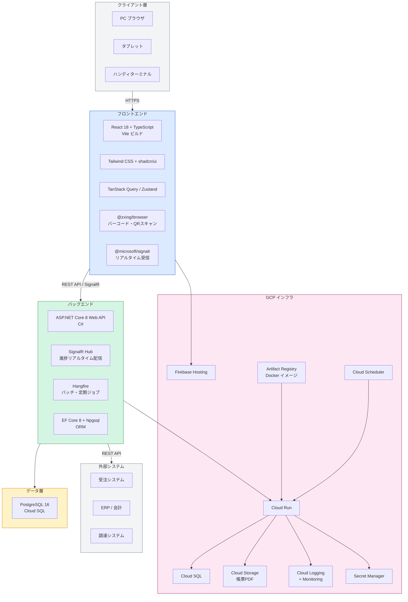
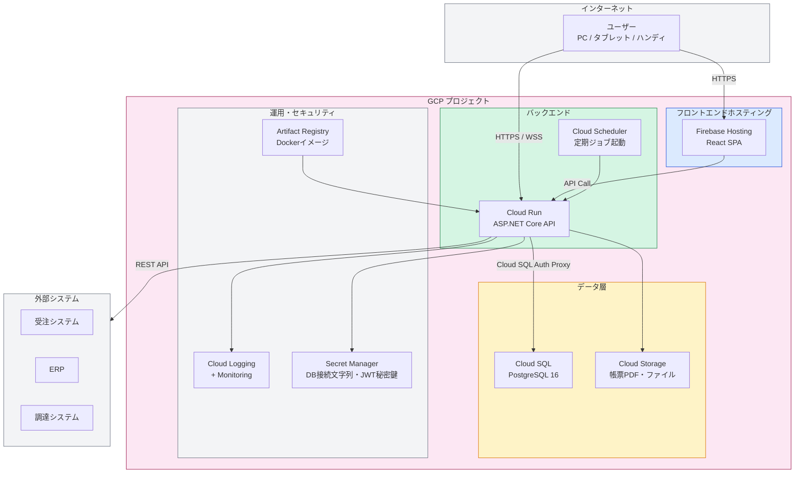
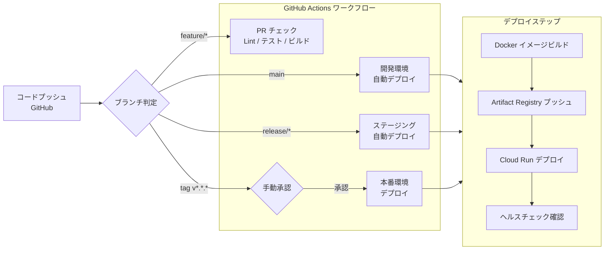

# 10. 技術スタック・開発環境

## 10.1 技術スタック全体図



---

## 10.2 フロントエンド

### 採用技術一覧

| カテゴリ | ライブラリ / ツール | バージョン | 選定理由 |
|---------|------------------|-----------|---------|
| フレームワーク | React | 18.x | コンポーネントベース・エコシステムの豊富さ・チーム指定 |
| 言語 | TypeScript | 5.x | 型安全・大規模運用での保守性向上 |
| ビルドツール | Vite | 5.x | 高速HMR・設定シンプル・SPA構成に最適 |
| ルーティング | React Router | v6 | 標準的なSPAルーティング |
| サーバー状態管理 | TanStack Query | v5 | APIキャッシュ・ローディング・エラー管理を一元化 |
| UIローカル状態 | Zustand | v4 | 軽量・シンプル・小規模チームに最適 |
| UIコンポーネント | shadcn/ui | latest | Tailwind CSS ベース・カスタマイズ容易・アクセシビリティ対応 |
| CSSフレームワーク | Tailwind CSS | v3 | ユーティリティファーストで高速UI開発 |
| HTTPクライアント | Axios | v1 | インターセプター・エラーハンドリングが容易 |
| リアルタイム | @microsoft/signalr | v8 | ASP.NET Core SignalR との連携（工程進捗リアルタイム表示） |
| バーコードスキャン | @zxing/browser | latest | ブラウザカメラAPIでQR・バーコード読取（ハンディ・タブレット対応） |
| フォーム管理 | React Hook Form | v7 | 製造指示・検査入力など多項目フォームの管理 |
| バリデーション | Zod | v3 | TypeScriptネイティブのスキーマバリデーション |
| グラフ・チャート | Recharts | v2 | 進捗・KPIダッシュボードのグラフ描画 |
| テスト | Vitest + Testing Library | latest | Viteとの親和性が高いユニットテスト |

### ディレクトリ構成（案）

```
src/
├── components/       # 共通UIコンポーネント
├── features/         # 機能ごとのモジュール
│   ├── manufacturing-order/  # 製造指示
│   ├── production-plan/      # 生産計画
│   ├── inventory/            # 在庫管理
│   ├── quality/              # 品質管理
│   ├── process/              # 工程管理
│   └── shipping/             # 出荷管理
├── hooks/            # カスタムフック
├── lib/              # Axios設定・SignalR設定等
├── pages/            # ページコンポーネント（ルート対応）
├── store/            # Zustandストア
└── types/            # 型定義
```

---

## 10.3 バックエンド

### 採用技術一覧

| カテゴリ | ライブラリ / フレームワーク | バージョン | 選定理由 |
|---------|--------------------------|-----------|---------|
| フレームワーク | ASP.NET Core Web API | .NET 8 (LTS) | チーム指定・高性能・Cloud Run対応 |
| 言語 | C# | 12 | チーム指定 |
| ORM | Entity Framework Core + Npgsql | 8.x | PostgreSQL対応・マイグレーション管理 |
| 認証・認可 | ASP.NET Identity + JWT Bearer | - | RBAC実装・標準的な.NET認証基盤 |
| リアルタイム | SignalR | 8.x | 工程進捗・アラートのWebSocket配信 |
| バッチ処理 | Hangfire | v1.8 | ジョブの管理UI・永続化・スケジューリング |
| バリデーション | FluentValidation | v11 | リクエストの宣言的バリデーション |
| オブジェクトマッピング | AutoMapper | v12 | Entity ↔ DTO の変換 |
| ログ | Serilog + Google.Cloud.Logging.Serilog | latest | 構造化ログ・Cloud Logging連携 |
| API仕様書 | Swashbuckle (OpenAPI/Swagger) | v6 | APIドキュメント自動生成 |
| テスト | xUnit + Moq | latest | ユニット・統合テスト |

### プロジェクト構成（案）

```
ManufacturingSystem.sln
├── ManufacturingSystem.API/          # ASP.NET Core Web API
├── ManufacturingSystem.Application/  # ビジネスロジック・ユースケース
├── ManufacturingSystem.Domain/       # ドメインモデル・エンティティ
├── ManufacturingSystem.Infrastructure/ # EF Core・外部連携
└── ManufacturingSystem.Tests/        # テストプロジェクト
```

### API 設計方針

- **RESTful API**：リソース単位でエンドポイントを設計
- **APIバージョニング**：`/api/v1/...` プレフィックス
- **レスポンス形式**：JSON、統一レスポンスラッパー（`{ success, data, error }`）
- **エラーハンドリング**：グローバル例外ハンドラーで統一レスポンス返却

---

## 10.4 データベース

| 項目 | 内容 |
|------|------|
| RDBMS | PostgreSQL 16 |
| GCPサービス | Cloud SQL for PostgreSQL（Flexible Server） |
| インスタンスタイプ | 開発：db-f1-micro / 本番：db-custom-2-7680（2vCPU・7.5GB RAM 以上） |
| ストレージ | SSD・自動拡張有効 |
| バックアップ | 日次自動バックアップ・7世代保管 |
| フェイルオーバー | 本番環境：高可用性（HA）構成（自動フェイルオーバー） |
| マイグレーション | EF Core Migrations（コードファーストで管理） |
| 接続 | Cloud SQL Auth Proxy（Cloud Run → Cloud SQL セキュア接続） |

---

## 10.5 GCPインフラ構成図



---

## 10.6 環境構成

| 環境 | 用途 | GCPプロジェクト | 備考 |
|------|------|----------------|------|
| 開発環境（ローカル） | 開発・単体テスト | ローカルDocker | Docker Compose で API + PostgreSQL を起動 |
| 開発環境（クラウド） | チーム共有・統合確認 | `mfg-sys-dev` | mainブランチへのマージで自動デプロイ |
| ステージング環境 | 結合テスト・UAT | `mfg-sys-stg` | 本番相当のデータ・構成で検証 |
| 本番環境 | 本番稼働 | `mfg-sys-prod` | リリースタグで手動承認後デプロイ |

---

## 10.7 CI/CDパイプライン



### ワークフロー概要

| ジョブ | トリガー | 内容 |
|--------|---------|------|
| lint-test | PR作成・更新 | ESLint / dotnet format / xUnit テスト実行 |
| build-push | main・release・tag | Dockerイメージビルド → Artifact Registryプッシュ |
| deploy-dev | main マージ | Cloud Run（開発）へ自動デプロイ |
| deploy-stg | release/* マージ | Cloud Run（ステージング）へ自動デプロイ |
| deploy-prod | tag（手動承認後） | Cloud Run（本番）へデプロイ |

---

## 10.8 ローカル開発環境セットアップ

### 前提ソフトウェア

| ソフトウェア | バージョン | 用途 |
|------------|-----------|------|
| .NET SDK | 8.x | バックエンド開発 |
| Node.js | 20.x LTS | フロントエンド開発 |
| pnpm | 9.x | フロントエンドパッケージ管理 |
| Docker Desktop | latest | ローカルコンテナ実行 |
| Git | latest | バージョン管理 |
| Visual Studio 2022 または VS Code | latest | IDE |

### ローカル起動手順（Docker Compose）

```yaml
# docker-compose.yml（イメージ）
services:
  db:
    image: postgres:16
    environment:
      POSTGRES_DB: manufacturing_db
      POSTGRES_USER: postgres
      POSTGRES_PASSWORD: localpassword
    ports:
      - "5432:5432"

  api:
    build: ./ManufacturingSystem.API
    environment:
      ConnectionStrings__Default: "Host=db;Database=manufacturing_db;Username=postgres;Password=localpassword"
      Jwt__SecretKey: "local-dev-secret-key"
    ports:
      - "5000:8080"
    depends_on:
      - db

  frontend:
    build: ./frontend
    ports:
      - "3000:3000"
    environment:
      VITE_API_BASE_URL: "http://localhost:5000"
```

```bash
# 起動コマンド
docker compose up -d

# DBマイグレーション実行
dotnet ef database update --project ManufacturingSystem.Infrastructure

# フロントエンド開発サーバー（HMR有効）
cd frontend && pnpm dev
```

### 環境変数管理

| 変数名 | 説明 | ローカル | 本番 |
|--------|------|---------|------|
| `ConnectionStrings__Default` | PostgreSQL接続文字列 | docker-compose.yml | Secret Manager |
| `Jwt__SecretKey` | JWT署名秘密鍵 | ローカル設定ファイル | Secret Manager |
| `Jwt__ExpiresMinutes` | JWTトークン有効期限（分） | appsettings.json | Secret Manager |
| `VITE_API_BASE_URL` | フロントエンドのAPIベースURL | .env.local | Firebase Hostingの環境設定 |
